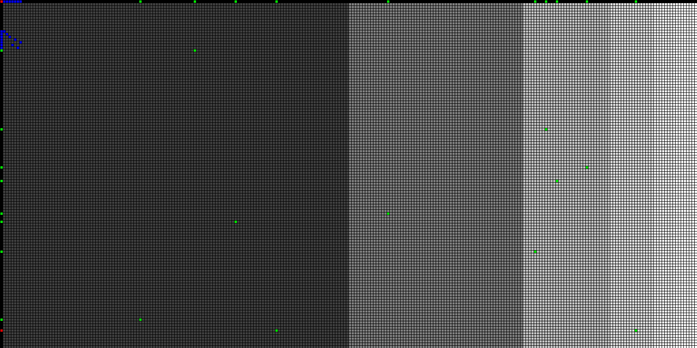

# Check and Layout A LookUpTable

both check the validity and show the layout of a LUT.

- Layout the LUT as a matrix (i.e. kind of digital 2D plot).
- Check columns and line for duplicates, i.e. errors in setup.

c est la LUT, est-elle correcte ou non ?!

# compile

## external library

- [`CImg`](http://www.cimg.eu/)
     - XWindows via `X11` development library for window output

~~~ { .bash }
sudo apt-get install cimg-dev cimg-doc cimg-examples libxrandr-dev
~~~

- [`ImageMagick`](http://imagemagick.org) via `CImg`
     - `convert` for PNG output

~~~ { .bash }
sudo apt-get install imagemagick
~~~

- or [`libPNG`](http://libpng.org/pub/png) via `CImg`
     - embedded PNG output, need compilation option.

~~~ { .bash }
sudo apt-get install libpng-dev
~~~

## git clone

git for both `CImg` and `claLUT`

~~~ { .bash }
git clone https://github.com/dtschump/CImg.git
git clone git@github.com:coupdair/claLUT.git
#or
git clone https://github.com/dtschump/CImg.git
git clone https://github.com/coupdair/claLUT.git
~~~

## C++ compilation

cf. [`_info.txt`](_info.txt)

e.g.

~~~ { .bash }
g++ -O0 -o claLUT claLUT.cpp -I../CImg -Wall -W -ansi -pedantic -Dcimg_use_vt100 -I/usr/X11R6/include  -lm -L/usr/X11R6/lib -lpthread -lX11 
~~~

# use

1. run binary: `claLUT`
1. check results on pop up window or `claLUT.png` file.

e.g.

~~~ { .bash }
#run with window output
./claLUT
#image output
display claLUT.png

#CLI options
./claLUT -h -I
./claLUT -v
~~~

